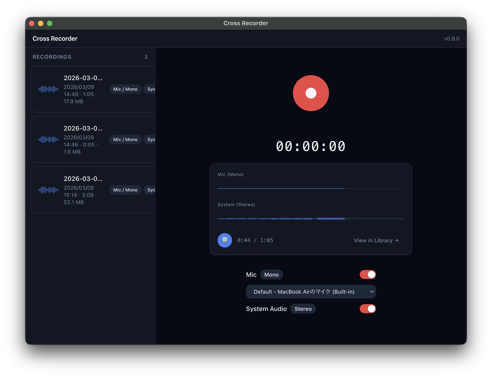

<div align="center">

# 🎙️ Cross Recorder

**A cross-platform desktop audio recorder with multi-track support**

Record microphone and system audio simultaneously into separate WAV tracks.
Built with [Electrobun](https://electrobun.dev), React, and native audio APIs.

[](https://github.com/tktcorporation/cross-recorder/actions/workflows/ci.yml)
[](https://github.com/tktcorporation/cross-recorder/actions/workflows/release.yml)
[](https://github.com/tktcorporation/cross-recorder/releases/latest)

<br />


</div>

---

## ✨ Features

- 🎤 **Multi-track recording** — Capture mic (mono) and system audio (stereo) simultaneously as separate WAV files
- 🖥️ **Native system audio** — macOS uses ScreenCaptureKit for direct system bus capture, no screen sharing dialog
- 🎚️ **Real-time level meters** — Pulsing visual feedback synchronized to mic and system audio levels
- 📊 **Live waveform** — Horizontal scrolling waveform visualization during recording and playback
- 🔀 **Multi-track playback** — Mix and scrub through recorded tracks with Web Audio API
- 📁 **Recording library** — Browse, play, and manage past recordings in a card-based sidebar
- 🔄 **Auto-updater** — Built-in update system with manual check support
- 💾 **Crash-resilient** — Periodic WAV header updates protect recordings from unexpected crashes

## 🖥️ Supported Platforms

| Platform | System Audio | Status |
|----------|-------------|--------|
| **macOS** (Apple Silicon) | ScreenCaptureKit (native) | ✅ Primary |
| **Windows** (x64) | getDisplayMedia (Web API) | ✅ Supported |

## 📦 Installation

Download the latest release for your platform:

**[→ Download from Releases](https://github.com/tktcorporation/cross-recorder/releases/latest)**

- **macOS**: `.tar.gz` (extract and move to Applications)
- **Windows**: `.zip` (extract and run)

### Requirements

- macOS 13.0+ (Ventura) for ScreenCaptureKit system audio
- Windows 10+

## 🛠️ Development

### Prerequisites

- [Bun](https://bun.sh) (latest)
- [pnpm](https://pnpm.io) v10+
- [Electrobun CLI](https://electrobun.dev)
- Xcode Command Line Tools (macOS, for native build)

### Setup

```bash
# Clone and install
git clone https://github.com/tktcorporation/cross-recorder.git
cd cross-recorder
pnpm install

# Start development
pnpm dev        # Electrobun dev with watch mode
pnpm dev:hmr    # Vite HMR + Electrobun (concurrent)

# Build
pnpm build      # Full production build

# Quality
pnpm test       # Run tests (Vitest)
pnpm lint       # Lint (oxlint)
pnpm typecheck  # TypeScript check
```

## 🏗️ Architecture

```
src/
├── bun/          # Main process (Bun runtime)
│   ├── services/ #   RecordingManager, FileService, UpdateService
│   └── rpc.ts    #   Typed RPC handlers (bun ↔ webview)
├── mainview/     # Renderer (CEF / React)
│   ├── audio/    #   AudioCaptureManager, PlaybackController, WavEncoder
│   ├── views/    #   RecordingView, LibrarySidebar
│   ├── stores/   #   Zustand state management
│   └── components/
├── shared/       # Types, RPC schema, errors, constants
└── native/       # Platform-specific code
    └── macos/    #   ScreenCaptureKit Swift binary
```

### Tech Stack

| Layer | Technology |
|-------|-----------|
| Desktop framework | [Electrobun](https://electrobun.dev) (Bun + CEF) |
| UI | React 18 · Tailwind CSS 3 · shadcn/ui · Framer Motion |
| State | Zustand 5 |
| Audio | Web Audio API · AudioWorklet · ScreenCaptureKit (macOS) |
| Error handling | [Effect.ts](https://effect.website) |
| Build | Vite 6 · pnpm · GitHub Actions |

### How Recording Works

1. **Capture** — `getUserMedia` (mic) + `getDisplayMedia` or ScreenCaptureKit (system audio)
2. **Process** — AudioWorklet extracts PCM samples in real-time
3. **Encode** — PCM → base64 → RPC → ChunkWriter appends to WAV files
4. **Protect** — WAV headers are periodically updated for crash resilience
5. **Store** — Recordings saved to `~/cross-recorder/recordings/` with JSON metadata

## 📄 License

This project is currently private. See the repository for details.

---

<div align="center">

Built with ❤️ using [Electrobun](https://electrobun.dev)

</div>
